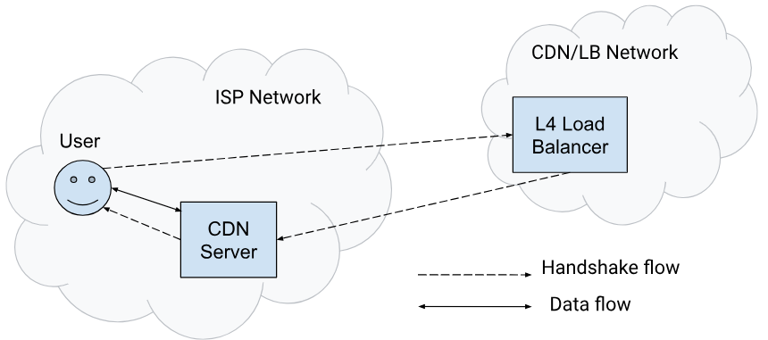

---
# You can also start simply with 'default'
theme: default
# some information about your slides (markdown enabled)
title: Quic server preferred address
# apply unocss classes to the current slide
class: text-center
# https://sli.dev/features/drawing
drawings:
  persist: false
# slide transition: https://sli.dev/guide/animations.html#slide-transitions
transition: slide-left
# enable MDC Syntax: https://sli.dev/features/mdc
mdc: true
hideInToc: true
colorSchema: light
---

## Anylayzing google's deployment of quic `server preferred address`

Georg Bär-Dumont // 18.02.2025

<!--
The last comment block of each slide will be treated as slide notes. It will be visible and editable in Presenter Mode along with the slide. [Read more in the docs](https://sli.dev/guide/syntax.html#notes)
-->

---
layout: quote
hideInToc: true
---

*"So far, only [Google’s Media CDN]{v-mark.red.highlight="1"} has widely enabled advertising an alternative address, but we expect more servers to adopt it soon. Testing has shown that this migration is successful over 99% of the time in Chrome and reduces average [RTT by 40-80%]{v-mark.red.underline="2"}."*

-- [Chromium Blog Post](https://blog.chromium.org/2024/12/making-chrome-quicer.html)

---
hideInToc: true
---

# How does it work?

[https://blogger.googleusercontent.com/img/b/R29vZ2xl/AVvXsEhPbECfw3krb6-1DM-wQBsBpPLhcLNGwGVMzEFW_XzUpumvfQzJSvVLJfZ1iwCyowq9QRE2bwl-GsQ8eArforqyyEBadmNN2iwUP59p3Rl428qWPqaJFu2JYe9o7QsuWa20R1s_isnM7efkNIMSetkmnyhFuQOtRt1-7G_e4NNb-BSfXP-DhVB_X5c6QZ0V/s1600/Screenshot%202024-12-17%2012.07.47%20PM.png]{style="font-size: 8px; line-height: normal; margin-bottom: 85px"}

---
hideInToc: true
---

# Outline

<Toc text-sm />

---

# Experiment Setup: server preferred address detection

1. Send requests to Google Media CDN i.e. Watch <logos-youtube />
2. Capture TLS Handshake Traffic 
3. Analyze Quic Transport Parameters

**Expected Result**: [list of DNS names]{v-mark.red.underline="1"} of CDN-Servers, that use server preferred address

(potential) **Next Step**: Measure [difference in performance]{v-mark.red.box="2"} of using the preferred address vs. using the original address

---
---

# Building a Youtube Crawler

---

# Result

- No service uses it
- Caveat: I can only test from my own network (Vodafon)

---

# Quic Client Support for spa migration

---

# Sources

## Images
https://blogger.googleusercontent.com/img/b/R29vZ2xl/AVvXsEhPbECfw3krb6-1DM-wQBsBpPLhcLNGwGVMzEFW_XzUpumvfQzJSvVLJfZ1iwCyowq9QRE2bwl-GsQ8eArforqyyEBadmNN2iwUP59p3Rl428qWPqaJFu2JYe9o7QsuWa20R1s_isnM7efkNIMSetkmnyhFuQOtRt1-7G_e4NNb-BSfXP-DhVB_X5c6QZ0V/s1600/Screenshot%202024-12-17%2012.07.47%20PM.png, Access at 01.27.2025

